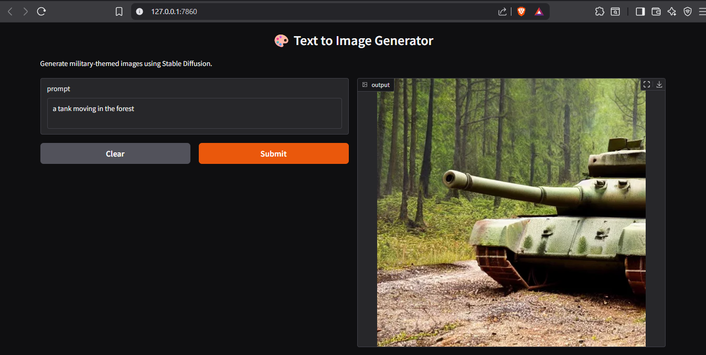
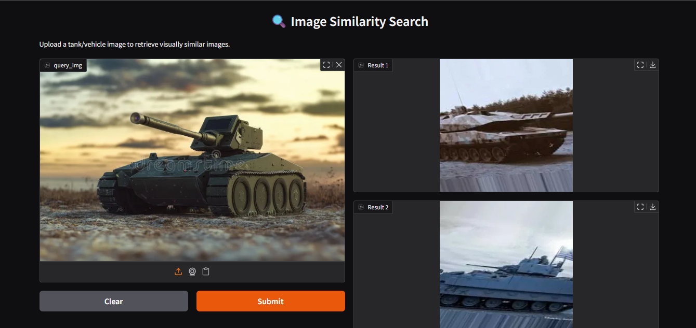

🪖 TankChatBot – Offline Image Generator & Retriever

TankChatBot is a fully **offline AI-powered application** that can:
- 🎨 Generate military-themed images from text prompts using **Stable Diffusion**
- 🔍 Retrieve similar images based on an input image using **CLIP embeddings**

Built to run **entirely offline**, this project is ideal for secure or disconnected environments where internet access is restricted.

---

## 🚀 Features

| Feature                  | Description |
|--------------------------|-------------|
| 🧠 **Text-to-Image Generation** | Uses Stable Diffusion to create military-themed visuals from text prompts |
| 🖼️ **Image-to-Image Retrieval** | Finds and displays the most similar images from a local dataset using CLIP |
| 🛡️ **Fully Offline**             | All models and data are stored locally—no internet required at runtime |
| 🧰 **Simple UI**                 | Clean interface built using Gradio and optionally Flask |
| ⚙️ **Modular Codebase**          | Easy to extend or plug in new models and data sources |

---

## 📁 Project Structure
tank_chatbot/

├── app.py # Main app runner (Gradio/Flask interface)

├── image_generator.py # Text-to-image logic using Stable Diffusion

├── image_retriever.py # CLIP-based image retrieval logic

├── image_index.pkl # Precomputed image embeddings

├── static/ # Images used for similarity matching

├── templates/ # HTML templates (if Flask is used)

├── README.md

yaml
Copy
Edit

---

## 🖼️ Example Outputs

### Text-to-Image
Prompt: `"a tank moving in the forest"`

### Image-to-Image Retrieval
Input:

Top Matches:

---

## ⚙️ Installation & Setup

### 1. Clone the Repository

``bash
git clone https://github.com/yourusername/tank_chatbot.git
cd tank_chatbot
### 2. Install Dependencies
Create a virtual environment and install dependencies:

bash
Copy
Edit
pip install -r requirements.txt
Make sure you have the following locally:

Stable Diffusion model weights (.ckpt or diffusers format)

CLIP model

image_index.pkl (precomputed feature vectors using CLIP)

Dataset folder - https://www.kaggle.com/datasets/amanrajbose/normal-vs-military-vehicles

### 3. Run the App
bash
Copy
Edit
python app.py
Then go to http://127.0.0.1:7860 in your browser.

📦 Requirements
|--- Python 3.9+

|--- PyTorch

|--- Stable Diffusion (via diffusers or similar)

|--- CLIP (openai/clip)

|--- Gradio or Flask

📌 TODOs
|--- Add toggle for switching between Gradio and Flask

|--- Add download button for generated images

|--- Improve UI with theme customization

|--- Batch retrieval results as a grid

|--- Add GPU usage toggle for low-end systems

🛡️ License
MIT License. Feel free to use and modify.

✨ Acknowledgements
|---CompVis/stable-diffusion

|---OpenAI CLIP

|---Hugging Face Transformers & Diffusers

